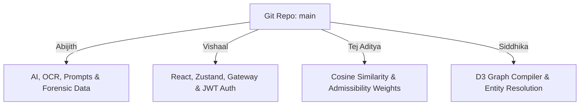

# VAJRA.AI V4 — AI Investigation Operating System
*Government-Grade Case Ingress, Chronological Timeline Assembly, and Cryptographic Tamper-Proof Auditing*

VAJRA.AI is a premium, high-fidelity AI-powered Investigation operating system built on Zoho Catalyst. Designed specifically for the State Crime Record Bureau (SCRB) Karnataka, the platform streamlines document ingress, Zia OCR textual extraction, BNS legal reference mapping, and cryptographic audit logs to create a highly visual, secure "Situation Room" for police investigators.

---

## 🎨 Visual Identity & Premium Design System

Steering clear of standard cyberpunk tech-tropes and generic neon-blue AI widgets, VAJRA.AI utilizes an **editorial-luxury visual theme** inspired by premium consulting and modern architectural branding:

*   **Warm Ivory (`#FAF7F2`)**: Primary workspace surface, creating a human-centered, calm visual environment.
*   **Charcoal (`#2D2424`)**: Deep structural text, borders, and layouts.
*   **Dusty Rose (`#B36A70`)**: Primary signature accent color for interactive states, key buttons, and official badge logos.
*   **Sandstone (`#C2A878`)** & **Soft Taupe (`#D9D2C7`)**: Secondary accents used for connection network nodes and information metadata tags.
*   **Typography**: Serif headers (**Playfair Display**) combined with clean sans-serif content (**Plus Jakarta Sans**).

---

## ⚙️ Work Progress Status (Sprints 0 - 4 Completed)

We have scaffolded and compiled the baseline infrastructure of the platform:
*   `[x]` **Database Engine**: Configured schema targets (`schema.sql`) for Zoho Catalyst Data Store.
*   `[x]` **Serverless Core**: Built Node.js basic functions for agent orchestrations and API routing tables.
*   `[x]` **Situation Room UI**: Set up conditional Vite routing portals, secure badge logins, timeline builders, explainability cards, and cryptographic validation dialog overlays.
*   `[x]` **Agent Logic**: Written native test runner script (`agentTests.js`) validating timeline heuristics, BNS mapping models, and SQL injection sanitizers with **3/3 tests passing successfully**.

---

## 🚀 Running Deployed Mock & Dev Servers

Follow these steps to launch the local sandbox on your machine:

### 1. Launch Dev API Backend Wrapper
```bash
cd "vajra-backend/functions/api_gateway"
npm install
node local_server.js
```
*Port `8080` will initialize a mock Catalyst SDK instance, ensuring all routing triggers function cleanly offline.*

### 2. Launch Vite React Frontend
```bash
cd "frontend"
npm install
npm run dev
```
*Open `http://localhost:5173/` in Chrome. Turn on **Datathon Mock Mode** on the login page to run simulations using cached state pipelines.*

---

## 🛠️ Transitioning to Production (Making it "Real")

To go live with real database queries and active AI API requests, execute these steps:

### A. Configure Database & Auth
1. **Catalyst Datastore**: Create the tables defined in `vajra-backend/schema.sql` on the Zoho Catalyst cloud console.
2. **Password Security**: In `authController.js`, implement `bcrypt` password comparison, replacing hardcoded checks with database queries to the `officers` table.

### B. Activate Zia OCR & LLMs
1. **OCR Bucket**: Create a Catalyst File Store bucket named `evidence_bucket` and extract its folder ID.
2. **Zia OCR Hook**: In `evidenceController.js`, activate the commented `req.catalyst.zia()` optical character recognition API.
3. **LLM Connection**: In the Catalyst console, define connection headers for OpenAI/Gemini or Zia Custom AI models and register the API keys in your environment variables.
4. **Mock Bypass**: Switch `mockMode: false` inside `frontend/src/store.js` as the default state to bypass cached responses.

### C. Live Cloud Deployment
*   **Deploy Cloud Functions**: Run `catalyst deploy` from the project root.
*   **Deploy Frontend Web Client**: Run `catalyst deploy --only hosting` to host the client on Catalyst, or deploy the Vite `dist/` bundle directly to Vercel/Netlify.

---

## 👥 Team Work Split & Repository Policy

Team status as of July 12, 2026: 4 active contributors, deadline July 26, 2026 (Datathon 2026).



### Git Branching Rules
1. Never commit code directly to `main`.
2. Create feature branches: `git checkout -b feat/your-feature-name`
3. Push changes and submit a **Pull Request (PR)** on GitHub for code review before merging.

### Work Split Assignments

#### 👤 Abijith (Lead & AI Architect)
*   **Focus**: Zia OCR Integration, LLM Connections, System Prompt layouts, and Forensic matching.
*   **Source Files**: `evidenceController.js`, `timelineAgent.js`, `legalAgent.js`.

#### 👤 Vishaal (Fullstack Dev + Deployment Config)
*   **Focus**: React pages, Zustand store actions, API fetch integrations, JWT bcrypt token verification, and Zoho Catalyst deployment config (sovereign cloud binding, environment/secrets setup).
*   **Source Files**: `store.js`, `Login.jsx`, `Dashboard.jsx`, `authController.js`.

#### 👤 Tej Aditya (ML Specialist)
*   **Focus**: Cosine distance case comparison algorithms and trust reliability scoring.
*   **Source Files**: `caseController.js`, `similarityService.js`.
*   **Note**: Joining full-time from July 13 (exam commitment July 12).

#### 👤 Siddhika (Python / Viz Specialist)
*   **Focus**: Suspect/CDRs entity resolution graphs and D3/SVG network chart components.
*   **Source Files**: `networkService.js`, `Dashboard.jsx`.
*   **Note**: Rejoining the project from ~July 14.

