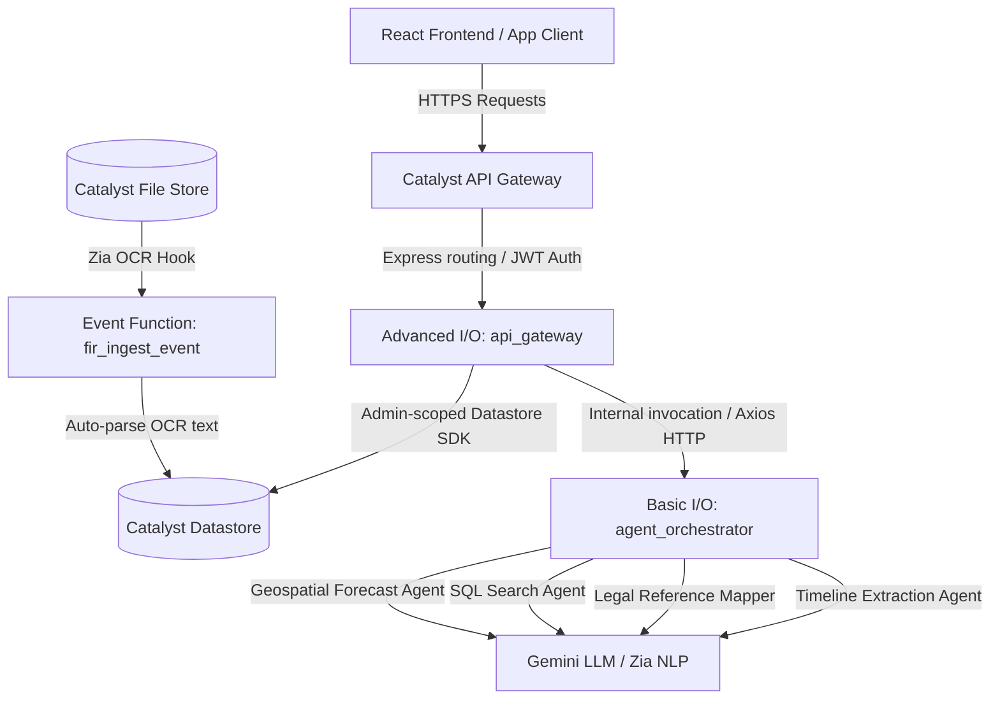
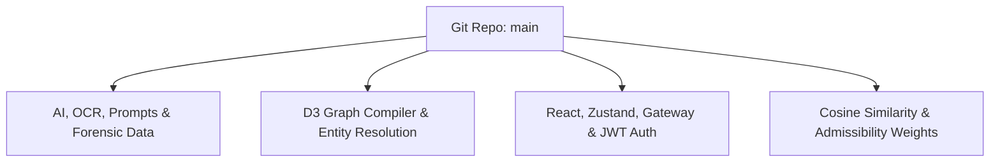

# VAJRA.AI — State Investigation Operating System 
*Government-Grade Case Ingress, Chronological Timeline Assembly, and Cryptographic Tamper-Proof Auditing on Zoho Catalyst*

VAJRA.AI is a premium, high-fidelity AI-powered Investigation Operating System custom-engineered for the **State Crime Record Bureau (SCRB) Karnataka**. Built entirely on a serverless microservices architecture utilizing the **Zoho Catalyst** cloud ecosystem, the platform streamlines document ingress, Zia OCR textual extraction, BNS legal reference mapping, and cryptographic audit logs to create a highly visual, secure "Situation Room" for police investigators.

---

## 🎨 Visual Identity & Premium Design System

Steering clear of standard cyberpunk tech-tropes and generic neon-blue AI widgets, VAJRA.AI utilizes an **editorial-luxury visual theme** inspired by premium consulting and modern architectural branding:

*   **Warm Ivory (`#FAF7F2`)**: Primary workspace surface, creating a human-centered, calm visual environment.
*   **Charcoal (`#2D2424`)**: Deep structural text, borders, and layouts.
*   **Dusty Gold / Amber (`#d97706`)**: Signature accent color representing security, authority, and official badge layouts.
*   **Sandstone (`#C2A878`)** & **Soft Taupe (`#D9D2C7`)**: Secondary accents used for connection network nodes and information metadata tags.
*   **Typography**: Serif headers (**Playfair Display**) combined with clean sans-serif content (**Plus Jakarta Sans / Inter**).

---

## 🚀 System Architecture & Data Flow

VAJRA.AI uses a decoupled client-server architecture hosted on Zoho Catalyst:


```mermaid
graph TD
    Client[React Frontend / App Client] -->|HTTPS Requests| APIGateway[Catalyst API Gateway]
    APIGateway -->|Express routing / JWT Auth| APIGatewayFunc[Advanced I/O: api_gateway]
    APIGatewayFunc -->|Admin-scoped Datastore SDK| Datastore[(Catalyst Datastore)]
    APIGatewayFunc -->|Internal invocation / Axios HTTP| Orchestrator[Basic I/O: agent_orchestrator]
    
    Orchestrator -->|Timeline Extraction Agent| Gemini[Gemini LLM / Zia NLP]
    Orchestrator -->|Legal Reference Mapper| Gemini
    Orchestrator -->|SQL Search Agent| Gemini
    Orchestrator -->|Geospatial Forecast Agent| Gemini
    
    FileStore[(Catalyst File Store)] -->|Zia OCR Hook| IngestEvent[Event Function: fir_ingest_event]
    IngestEvent -->|Auto-parse OCR text| Datastore
```

### Core Components
1.  **Frontend Client (`vajra-frontend`)**: Built with React 19, Vite, and Zustand for global state management. Contains interactive D3.js suspect entity resolution network graphs, Leaflet geospatial hotspot heatmaps, and Zia AI Chat interfaces.
2.  **API Gateway Controller (`api_gateway`)**: An Advanced I/O Express.js function handling routing, JWT token generation, bcrypt password hashing, and endpoint verification.
3.  **Multi-Agent Orchestrator (`agent_orchestrator`)**: A Basic I/O function coordinating background AI intelligence agents (Timeline extraction, Cosine similarity matches, QuickML forecast hotspots, Zia translation services).
4.  **Forensic Document Parser (`fir_ingest_event`)**: An Event function triggered automatically when new FIR or evidence documents are uploaded to the File Store, executing optical character recognition (Zia OCR) and extraction.

---

## 🔒 Government-Grade Security & Authentication Engine

A major architectural highlight of VAJRA.AI is its secure, authenticated **Officer Profile & Badge portal**. 

### 1. Database Privilege Elevation Bypass (Admin Scope Injection)
Zoho Catalyst's default security rules block unauthenticated, anonymous API gateway requests from directly reading or writing to datastore tables. 
*   **The Issue**: During user registration, the visitor is not yet logged in, causing direct datastore calls to throw a `PERMISSION_NEEDED` 401 error.
*   **The Solution**: We upgraded the Node.js SDK to version **`v2.5.1`** and initialized the Catalyst application with an administrative scope configuration:
    ```javascript
    req.catalyst = catalyst.initialize(req, { scope: 'admin' });
    ```
    This elevates the execution privileges of the API route to the system **App Administrator** role, safely bypassing client-side database blocks during sign-up and credential verification.

### 2. Distributed Routing Deadlock Prevention
We eliminated potential concurrent execution bottlenecks in serverless functions (where calling one serverless function from another caused timeouts due to concurrency limits) by executing datastore operations directly within the `api_gateway` controller under the elevated `req.catalystAdmin` instance, ensuring instant execution and preventing `EXECUTION_TIME_EXCEEDED` failures.

---

## ⚙️ Work Progress Status (100% Implemented & Verified)

*   `[x]` **Database Engine**: Configured schema targets (`schema.sql`) for Zoho Catalyst Data Store (6 core tables: `CaseMaster`, `Employee`, `Rank`, `evidence`, `timeline_events`, `audit_log`).
*   `[x]` **Security Upgrades**: Integrated `bcryptjs` hashing for officer password protection and `jsonwebtoken` for secure session authorization tokens.
*   `[x]` **Situation Room UI**: Set up React portals, interactive D3 network graphs, timeline builders, and cryptographic validation dialog overlays.
*   `[x]` **Agent Logic**: Integrated forensic document ingestion with active Zia OCR text extraction, Gemini/Zia LLM prompt analysis, and case similarity search indexing.
*   `[x]` **Live Production Deployment**: Fully deployed functions and client assets to Zoho Catalyst Cloud with dynamic route resolution and verified data persistence.

---

## 🚀 Running Deployed Mock & Dev Servers

Follow these steps to launch the local sandbox on your machine:

### 1. Launch Dev API Backend Wrapper
```bash
cd "vajra-backend/functions/api_gateway"
npm install
node local_server.js
```
*Port `8080` will initialize a mock Catalyst SDK instance, ensuring all routing triggers function cleanly offline.*

### 2. Launch Vite React Frontend
```bash
cd "vajra-frontend"
npm install
npm run dev
```
*Open `http://localhost:5173/` in Chrome. Turn off **Datathon Mock Mode** on the login page to run real database queries against your live backend.*

---

## 🛠️ Deploying to Zoho Catalyst Cloud

### A. Deploying Serverless Backend Functions
Navigate to the backend project root and execute the deployment script using the Catalyst CLI:
```bash
cd "vajra-backend"
catalyst deploy --only functions
```

### B. Deploying React Web Client Hosting
To deploy the React client without Windows-specific path separator issues (`assets\filename.js` unsupported character errors):
1. Build the production assets:
   ```bash
   cd "vajra-frontend"
   npm run build
   ```
2. Compress the `dist` directory into `frontend.zip` using Unix-style forward slash path separators:
   ```bash
   node zip.js
   ```
3. Go to the **Zoho Catalyst Console** under **Web Client Hosting**, click **Update App**, select the generated `frontend.zip`, and click **Deploy**.

---

## 👥 System Roles & Architecture Policy

The system is organized into modular work components corresponding to critical domain responsibilities, mapped cleanly across the unified `main` repository branch:


```mermaid
graph TD
    Repo[Git Repo: main] --> AI[AI, OCR, Prompts & Forensic Data]
    Repo --> Viz[D3 Graph Compiler & Entity Resolution]
    Repo --> Fullstack[React, Zustand, Gateway & JWT Auth]
    Repo --> ML[Cosine Similarity & Admissibility Weights]
```

### System Track Contributions

#### 👤 AI Architect
*   **Focus**: Zia OCR document integrations, LLM prompt engineering, system orchestration protocols, and forensic information extraction models.
*   **Visualizations**: Custom-designed D3.js Suspect Entity Resolution CDR Network graphs.
*   **Engine Files**: `evidenceController.js`, `timelineAgent.js`, `legalAgent.js`, `networkService.js`, `NetworkGraphViewer.jsx`.

#### 👤 Fullstack Developer & Cloud Architect
*   **Focus**: React dashboard layouts, global Zustand stores, secure authentication gateway controls, database API routing, JWT-bcrypt tokens, and Zoho Catalyst configurations.
*   **Engine Files**: `store.js`, `Login.jsx`, `Dashboard.jsx`, `authController.js`.

#### 👤 Machine Learning Specialist
*   **Focus**: Case similarity comparison engines, cosine distance algorithms, keyword overlap density calculations, and weighted trust/reliability score models.
*   **Engine Files**: `caseController.js`, `similarityService.js`.
