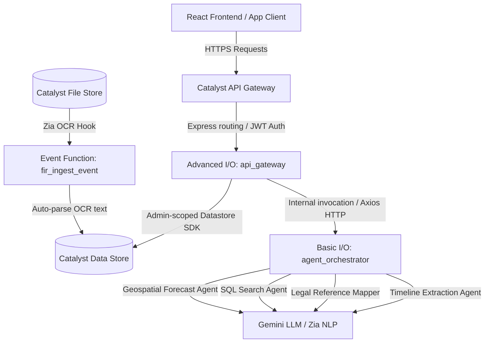
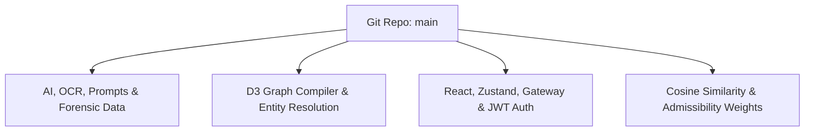

# 🛡️ VAJRA.AI — State Investigation Operating System 

VAJRA.AI is a premium, serverless AI-powered Investigation Operating System custom-engineered for the **State Crime Record Bureau (SCRB), Karnataka**. The platform integrates document ingestion, Zia OCR textual extraction, BNS legal reference mapping, and cryptographic audit logs to create a highly visual, secure "Situation Room" for police investigators.

*   **GitHub Repository**: [github.com/abi131205/VAJRA.AI](https://github.com/abi131205/VAJRA.AI)
*   **Deployed Web Portal**: [project-rainfall-60073738508.development.catalystserverless.in/app/](https://project-rainfall-60073738508.development.catalystserverless.in/app/)

---

## ⚙️ Core Capabilities Implemented

*   **Interactive Situation Room**: A unified investigative workspace displaying state-wide crime statistics, geographical distribution charts, and a dynamic case index directory.
*   **Dynamic Entity Resolution Network**: Interactive D3-powered suspect association graphs mapping relations between suspects, phone SIM cards, vehicles, and evidence files.
*   **Chronological Timeline Assembly**: Automatically reconstructs a case's chronological sequence of events from raw reports, logs, and officer check sheets.
*   **Zia AI Legal Assistant**: A chat co-pilot that streams real-time BNS legal references, timelines, and prosecution arguments in clean markdown.
*   **Cryptographic Audit Ledger**: An immutable, hash-chained ledger that logs case modifications and allows investigators to cryptographically verify database integrity.
*   **Geospatial Hotspots Heatmap**: Maps crime forecast hotspots and coordinates across multiple districts in Karnataka (MG Road, Electronic City, Mysuru, Mangaluru, Hubballi, Belagavi, Kolar).

---

## 🎨 Visual Identity & Premium Design System

The visual design utilizes an **editorial-luxury visual theme** representing security, authority, and official badge layouts:

*   **Warm Ivory (`#FAF7F2`)**: Primary workspace surface.
*   **Charcoal (`#2D2424`)**: Deep structural text, layout wrappers, and borders.
*   **Dusty Gold / Amber (`#D97706`)**: Signature accent representing badge branding and status indicators.
*   **Sandstone (`#C2A878`)** & **Soft Taupe (`#D9D2C7`)**: Accents used for visualizer nodes and tags.
*   **Typography**: Serif headers (**Playfair Display**) combined with clean sans-serif content (**Plus Jakarta Sans / Inter**).

---

## 🚀 System Architecture & Data Flow

VAJRA.AI is built on a decoupled, serverless microservices architecture hosted on Zoho Catalyst:


```mermaid
graph TD
    Client[React Frontend / App Client] -->|HTTPS Requests| APIGateway[Catalyst API Gateway]
    APIGateway -->|Express routing / JWT Auth| APIGatewayFunc[Advanced I/O: api_gateway]
    APIGatewayFunc -->|Admin-scoped Datastore SDK| Datastore[(Catalyst Data Store)]
    APIGatewayFunc -->|Internal invocation / Axios HTTP| Orchestrator[Basic I/O: agent_orchestrator]
    
    Orchestrator -->|Timeline Extraction Agent| Gemini[Gemini LLM / Zia NLP]
    Orchestrator -->|Legal Reference Mapper| Gemini
    Orchestrator -->|SQL Search Agent| Gemini
    Orchestrator -->|Geospatial Forecast Agent| Gemini
    
    FileStore[(Catalyst File Store)] -->|Zia OCR Hook| IngestEvent[Event Function: fir_ingest_event]
    IngestEvent -->|Auto-parse OCR text| Datastore
```

### 1. Database Privilege Elevation Bypass (Admin Scope Injection)
Zoho Catalyst's default security rules block unauthenticated API requests from reading or writing to datastore tables. To handle officer sign-up and credential verification safely, the backend initializes the Catalyst application with elevated administrative privileges:

```javascript
req.catalyst = catalyst.initialize(req, { scope: 'admin' });
```
This bypasses client-side database blocks during authentication while keeping the gateway secure.

### 2. Forensic Document Parser (`fir_ingest_event`)
An Event function triggered automatically when new FIR or evidence documents are uploaded to the File Store, executing optical character recognition (Zia OCR) and extraction.

---

## 🛠️ How to Run Locally (Sandbox Mode)

Follow these steps to launch the local development environment:

### 1. Launch Dev API Backend Wrapper
```bash
cd "vajra-backend/functions/api_gateway"
npm install
node local_server.js
```
*Initializes an offline mock server on Port `8080` representing the Catalyst environment.*

### 2. Launch Vite React Frontend
```bash
cd "vajra-frontend"
npm install
npm run dev
```
*Open `http://localhost:5173/` in your browser. Turn off Datathon Mock Mode on the login page to run database queries against your live/local backend API.*

---

## 📦 Deploying to Zoho Catalyst Cloud

### A. Deploying Serverless Backend Functions
Execute the deployment using the Catalyst CLI in the backend root directory:
```bash
cd "vajra-backend"
catalyst deploy --only functions
```

### B. Deploying React Web Client Hosting
To avoid path-separator issues during uploads:
1. Build the production React assets:
   ```bash
   cd "vajra-frontend"
   npm run build
   ```
2. Compress the `dist` directory into a web-hosting archive:
   ```bash
   node zip.js
   ```
3. Go to the **Zoho Catalyst Console** under **Web Client Hosting**, click **Update App**, select the generated `frontend.zip`, and click **Deploy**.

---

## 👥 System Track Contributions

The system is organized into modular work components corresponding to critical domain responsibilities, mapped cleanly across the unified `main` repository branch:


```mermaid
graph TD
    Repo[Git Repo: main] --> AI[AI, OCR, Prompts & Forensic Data]
    Repo --> Viz[D3 Graph Compiler & Entity Resolution]
    Repo --> Fullstack[React, Zustand, Gateway & JWT Auth]
    Repo --> ML[Cosine Similarity & Admissibility Weights]
```

### System Track Contributions

#### 👤 AI Architect
*   **Focus**: Zia OCR document integrations, LLM prompt engineering, system orchestration protocols, and forensic information extraction models.
*   **Visualizations**: Custom-designed D3.js Suspect Entity Resolution CDR Network graphs.
*   **Engine Files**: `evidenceController.js`, `timelineAgent.js`, `legalAgent.js`, `networkService.js`, `NetworkGraphViewer.jsx`.

#### 👤 Fullstack Developer & Cloud Architect
*   **Focus**: React dashboard layouts, global Zustand stores, secure authentication gateway controls, database API routing, JWT-bcrypt tokens, and Zoho Catalyst configurations.
*   **Engine Files**: `store.js`, `Login.jsx`, `Dashboard.jsx`, `authController.js`.

#### 👤 Machine Learning Specialist
*   **Focus**: Case similarity comparison engines, cosine distance algorithms, keyword overlap density calculations, and weighted trust/reliability score models.
*   **Engine Files**: `caseController.js`, `similarityService.js`.
